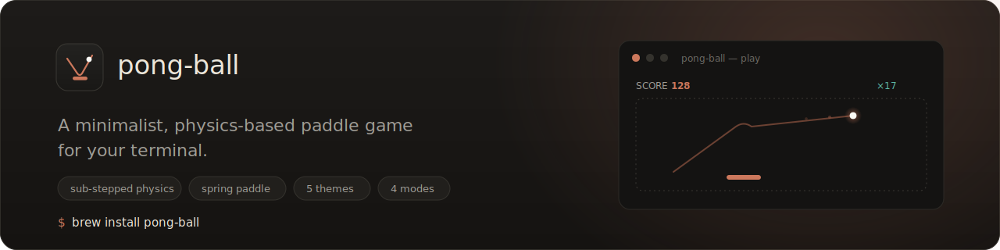
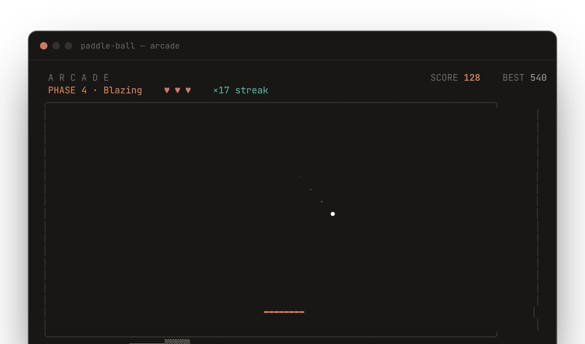

<div align="center">

<a href="https://pongball.mvp-subha.me">
  
</a>

<br />

[](https://github.com/subhadeeproy3902/pong-ball/releases)
[](https://github.com/subhadeeproy3902/pong-ball/actions)
[](https://go.dev)
[](LICENSE)

**[Website](https://pongball.mvp-subha.me)** · **[Install](#install)** · **[Releases](https://github.com/subhadeeproy3902/pong-ball/releases)** · **[Controls](#controls)**

</div>

---

## Features

- **Sub-stepped physics** — the ball advances in collision-safe sub-steps, so it never tunnels through a wall or resets mid-rally, even at top speed.
- **Spring-driven paddle** — a harmonica spring gives weighty, fluid control. Use the keys, or just move your **mouse** and the paddle follows.
- **Five quiet themes** — Claude (default), Mono, Nord, Moss, Ember. Each leans on a single accent — no rainbow, no neon, no glow.
- **Three modes** — Classic, Arcade (lives + power-ups), and Time Trial.
- **Six power-ups** — Wide Paddle, Slow Mo, Fire Paddle, Iron Shield, Ghost Ball, Bomb (Arcade).
- **Five difficulty phases** — auto-escalating by score, Warm Up → Insane.
- **Real sound** — crisp arcade SFX from [soundcn](https://soundcn.xyz), embedded in the binary and played CGO-free (MCI on Windows, native players elsewhere); toggle with `M`.
- **Score history** — persistent JSON store with an in-game leaderboard, per-mode filters, and lifetime stats.
- **Single binary** — pure Go, zero runtime dependencies, one-command install.

---

## Gameplay

<div align="center">
  
  <br />
  <sub>Arcade · Claude theme — an actual rendered frame, not a mockup.</sub>
</div>

---

pong-ball ships as a single static binary. Pick your platform's package manager:

### Linux

```bash
# Debian / Ubuntu
sudo apt install pong-ball

# Fedora / RHEL / CentOS
sudo dnf install pong-ball

# openSUSE
sudo zypper install pong-ball

# Arch / Manjaro
sudo pacman -S pong-ball

# Alpine
sudo apk add pong-ball

# Universal (Snap)
sudo snap install pong-ball

# Universal (Flatpak)
flatpak install pong-ball

# Nix / NixOS
nix-env -iA nixpkgs.pong-ball
```

### macOS

```bash
# Homebrew
brew install pong-ball

# MacPorts
sudo port install pong-ball
```

### Windows

```powershell
# winget
winget install pong-ball

# Chocolatey
choco install pong-ball

# Scoop
scoop install pong-ball
```

### BSD

```sh
# FreeBSD
pkg install pong-ball
```

### Any OS (from source)

```bash
# Go — works anywhere the Go toolchain is installed
go install github.com/subhadeeproy3902/pong-ball@latest

# …or the install script
curl -sSL https://raw.githubusercontent.com/subhadeeproy3902/pong-ball/main/install.sh | sh
```

Prebuilt binaries and `.deb`/`.rpm`/`.apk` packages are on the
[releases page](https://github.com/subhadeeproy3902/pong-ball/releases).

### Uninstall

```bash
pong-ball uninstall
```

Prompts for confirmation, then removes the binary, the saved scores/config, and
the cached sound files. Add `--yes` to skip the prompt or `--keep-data` to keep
your scores. Installed through a package manager? Use its own uninstall too
(e.g. `brew uninstall pong-ball`, `scoop uninstall pong-ball`).

---

## Usage

```
pong-ball                     # title screen
pong-ball play                # jump straight in (Classic)
pong-ball play --mode arcade  # Arcade mode with power-ups
pong-ball play --mode timed   # 60-second blitz
pong-ball play --theme nord   # start on a chosen theme
pong-ball scores              # leaderboard
pong-ball scores --all        # full history
pong-ball scores --json       # raw JSON
pong-ball reset               # wipe saved scores
pong-ball uninstall           # remove the binary + its data
pong-ball version             # version info
```

## Controls

| Key | Action |
|---|---|
| `←` `→` / `A` `D` | Move the paddle |
| drag mouse | Hold the left button to move the paddle |
| `P` / `Space` | Pause / resume |
| `T` | Cycle color theme |
| `M` | Toggle sound |
| `C` | Clear score history (on the leaderboard) |
| `R` | Restart (pause / game over) |
| `?` / `H` | Help |
| `Q` / `Ctrl+C` | Quit |

---

## Difficulty phases

| Phase | Score | Speed | Paddle |
|---|---|---|---|
| Warm Up | 0+ | 100% | 14 |
| Heating Up | 10+ | 122% | 12 |
| On Fire | 25+ | 150% | 10 |
| Blazing | 50+ | 185% | 8 |
| Insane | 100+ | 230% | 6 |

---

## Development

```bash
git clone https://github.com/subhadeeproy3902/pong-ball
cd pong-ball
go mod tidy
go run .            # run the game
go test ./...       # unit tests (physics regression suite)
go build ./...      # build
```

### Release
```bash
git tag v1.0.0
git push origin v1.0.0   # tags trigger GitHub Actions → GoReleaser
```
Every push and PR runs build / vet / test; only `v*` tags run a release.

---

## Project structure

```
pong-ball/
├── main.go                 Entry point (version injection)
├── cmd/root.go             Cobra CLI commands
├── game/
│   ├── model.go            Types, Model struct, constructor
│   ├── update.go           Bubble Tea Update (input, mouse, ticks)
│   ├── view.go             Renderer (minimal dark HUD)
│   ├── physics.go          Sub-stepped collision + paddle response
│   ├── physics_test.go     Collision regression tests
│   ├── particles.go        Restrained particle system
│   ├── scoring.go          Points, streaks, phase transitions
│   ├── sound.go            Sound-effect events + throttling
│   └── audio*.go            Embedded MP3s + CGO-free playback backends
├── ui/theme.go             Five color themes + lipgloss helpers
├── store/store.go          Score + config persistence (atomic JSON)
├── assets/                 Logo, banner, OG image, screenshot, icons
├── index.html              Landing page (pongball.mvp-subha.me)
├── .goreleaser.yaml        Cross-compile + publish pipeline
└── .github/workflows       CI (build/vet/test) + tagged release
```

---

## Links

- **GitHub** — [github.com/subhadeeproy3902/pong-ball](https://github.com/subhadeeproy3902/pong-ball)
- **Twitter** — [@mvp_Subha](https://twitter.com/mvp_Subha)
- **LinkedIn** — [subhadeep3902](https://linkedin.com/in/subhadeep3902)

---

## License

MIT © [Subhadeep Roy](https://github.com/subhadeeproy3902)

*Built with [Bubble Tea](https://github.com/charmbracelet/bubbletea) and
[Lip Gloss](https://github.com/charmbracelet/lipgloss) from the
[Charm](https://charm.sh) ecosystem.*
